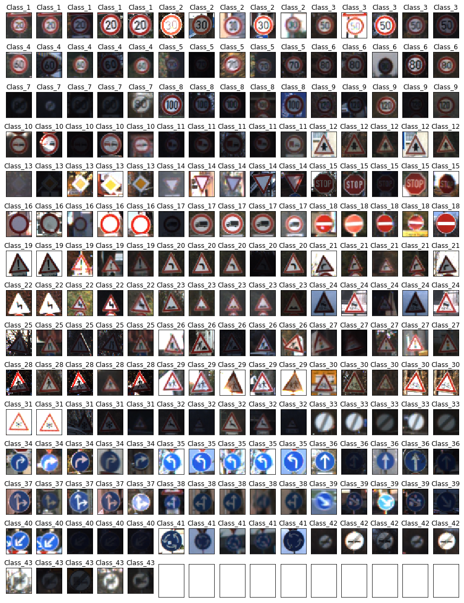
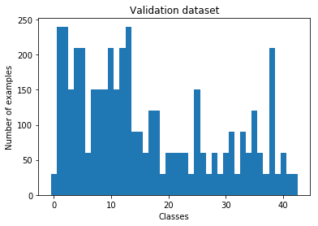
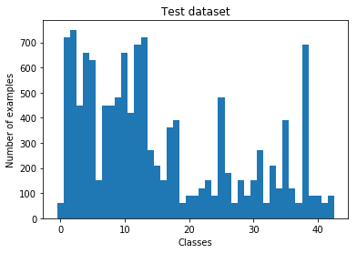
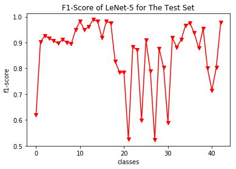
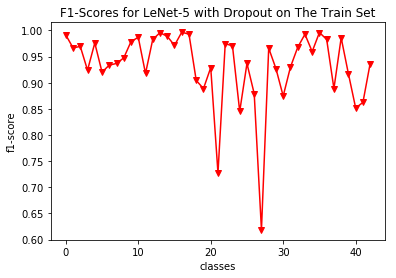
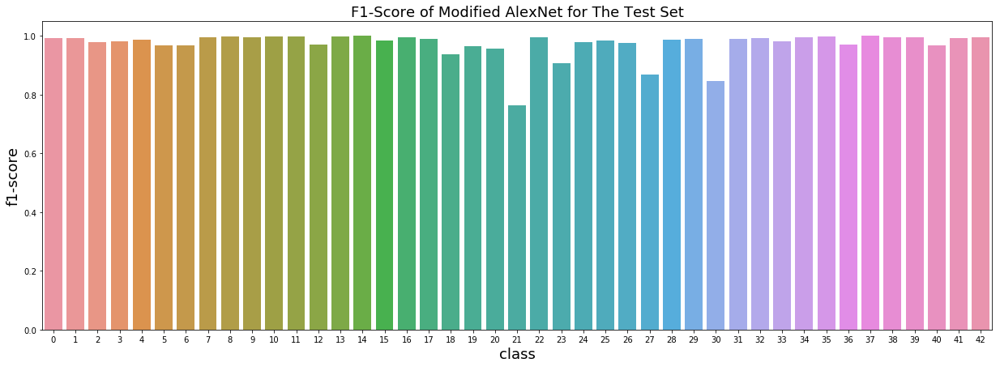

# German Traffic Signs Classifier Project

The aim of this project is to classify the German traffic signs with deep convolutional neural network architectures using the [Tensorflow framework](https://www.tensorflow.org/).

## The Dataset

The dataset provided by the [German Traffic Sign Recognition Benchmark (GTSRB)](http://benchmark.ini.rub.de/?section=gtsrb) and the details of the full dataset and the results of the final competition was reported by [the paper](http://image.diku.dk/igel/paper/MvCBMLAfTSR.pdf) written by J. Stallkamp and M. Schlipsing and J. Salmen and C. Igel.

The dataset used in this project is the same dataset provided by INI-GTSRB Benchmark with the images are prepared as downloadable pickle file formats by [Udacity self-driving car nanodegree program](https://www.udacity.com/drive). The dataset is available to download [here](https://drive.google.com/open?id=0B8c3GUF4ZQ-_R29QOWxDTkRJV3c).

### The train, validation and the test sets

The dataset is split into three parts as the train, validation and the test sets. The train set consists of 34799 examples, validation set only has 4410 examples and the test set has 12630 examples. The train set is used to train the deep convolutional neural network models while the validation set is used to fine tune the model hyperparameters. After fine tuning and training the models, the test set used to evaluate the model performance.

All the images in these sets has the same dimensions as 32x32 pixels of height and width and 3 (RGB) color channels. The total number of classes of the traffic signs is 43. The traffic sign examples from the same classes was captured in different ligthing conditions, from different viewpoints, some of them had 15x15 input resolution (all the images are resized to 32x32) and some of the examples have physical damage, graffiti and stickers. Some of the images for each class from the test set can be seen below.

|  The Visualization of Some of The Test Set Examples |
|:-------------------------:|
|   |

### The distribution of classes in the train, validation and the test sets

It is important to have each class in a dataset has approximately the same number of examples. The graphs below shows the frequency distribution of the classes in train, validation and test sets.

As seen from the frequency distributions, in each dataset, the number of examples are different for each class. When this is the case, an overfit may occur when training the model. Thus, for the last architecture, data augmentation will be applied for train and validation sets. In addition, if the trained model guessing at random or most of the time guesses for a class with high frequency, a simple accuracy evaluation may not reflect the truth. Thus, besides the accuracy evaluation, another error metric called [f1-score](https://en.wikipedia.org/wiki/F1_score), where the [precision and recall](https://en.wikipedia.org/wiki/Precision_and_recall) measures are used together, is also obtained for each class.

## The Model Architectures

### A) The LeNet Architecture

Source: ([Y. Lecun, L. Bottou, Y. Bengio and P. Haffner, 98](http://ieeexplore.ieee.org/document/726791/))

The augmented dataset, first trained on famous [LeNet-5 architecture](http://ieeexplore.ieee.org/document/726791/). A diagram of this architecture is seen above from Lecun's paper. The architecture consists of two convolutional, two subsampling layers, a flattened layer, two fully connected layers and a final output layer of logits. The input to LeNet-5 is 32x32x1 but since the dataset in this project has 3 color chanels, here the LeNet architecture takes images of 32x32x3 as input dimensions ([source](./Traffic_Sign_Classifier.ipynb)).

#### Details of the architecture

As mentioned above, the input images has 32x32x3 dimensions which is different from original LeNet having 3 color dimensions instead of 1. Layer 1 of the model is a convolutional layer having 5x5 kernel size with stride of 1x1, outputs 6 feature maps. After layer 1, a ReLu activation function and a 2x2 max pooling with a stride of 2x2 are applied. Layer 2 is again a convolutional layer with 5x5 kernel size and have 1x1 stride, layer 2 outputs 16 feature maps. After layer 2, ReLu activation function and again a 2x2 max pooling with a stride of 2x2 are applied. Final feature maps are flattened forming a fully connected layer as the layer 3 which has 400 input nodes. The layer 4 is a fully connected layers takes 400 inputs and outputs 120 nodes with ReLu activation function is applied. Layer 5 is again a fully connected layer takes 120 inputs and outputs 80 again with a ReLu activation function applied. The final layer is layer 5 and it takes 84 inputs from the previous layer and, differently from the original LeNet-5, outputs 43 logits for each class in this project.

#### The training and the results for Lenet-5 architecture

The LeNet-5 model tuned and trained on the original training and validation sets without any data augmentation applied. In the [training process](./trainer.py), stochastic gradient descent algorithm is used with mini-batch size of 128. Applying Xavier initialization for the weights gives the filexibility to choose larger learning rates ([X. Glorot and Y. Bengio, 2010](http://proceedings.mlr.press/v9/glorot10a.html)). Thus, applying Xavier initialization, the learning rate is taken as 0.1 with an exponential decay. An early stopping algorithm is applied with a limit of maximum number of epochs being 200. After the training, the test set is evaluated with the best model weights performed on the validation set.

The test accuracy with the best model is 92.24% and the f1-score for each class can be seen below.

F1-scores are given for each class. F1-score is a measure of precision and recall is used together. If the model predicts well on a class, that class should have high precision and recall values, which, here in this case, represented by the f1-score values very close to 1. As seen from the plot, most of the classes have very poor f1-score values. Various models with improvements and data augmentation will later be applied for this reason.

### B) The LeNet Architecture with Dropout

Dropout technique prevents neural networks from overfitting ([N. Srivastava, G. Hinton, A. Krizhevsky, I. Sutskever and R. Salakhutdinov, 2014](https://www.cs.toronto.edu/~hinton/absps/JMLRdropout.pdf)). The dropout refers to temporarily removing some of the randomly chosen hidden/visible units in a neural network on the training process. This way the dropout technique breaks up the co-adaptations of the nodes in a layer and the model generalizes well. Thus for the same LeNet-5 architecture above, dropout is applied for the fully connected layers to generalize the model.

#### The result for LeNet-5 with dropout

The same process of traning is again used for the same LeNet-5 architecture by additionally applying dropout to fully connected layers.

The test accuracy for the best model is 95.52% and the f1-scores can be seen below.

The accuracy and the f1-scores for each class are improved indicating that the model generalizes better when dropout is applied. However, on some of the classes the model still predicts very poorly

### C) The Alexnet Architecture

The alexnet model is the [ILSVRC](http://www.image-net.org/challenges/LSVRC/)-2012 competition winning, deep convolutional neural network architecture which had considerably better than the previous state-of-the-art results ([A. Krizhevsky, I. Sutskever and G. E. Hinton, 2012](https://papers.nips.cc/paper/4824-imagenet-classification-with-deep-convolutional-neural-networks)). The major difference from the LeNet-5 architecture is that AlexNet has more convolutional layers as being a deeper model. The LeNet-5 was built to train a dataset with 10 clases, while AlexNet was built to predict 1000 clases. In 2012, recently developed GPUs had let this kind of an extended deep convolutional network architecture to be able to trained in a reasonable time for large images of 1000 clases.

In the following years, it has been shown by the other ILSVRC deep convolutional network models that the deep models achieve better results ([K. Simonyan and A. Zisserman, 2014](https://arxiv.org/abs/1409.1556)). And even the skip connections help on very deep models that achieve even better results ([K. He, X. Zhang, S. Ren and J. Sun, 2015](https://arxiv.org/abs/1512.03385)). Since the dataset in this project has relatively small images and less classes (43 classes) a modified/scaled-down AlexNet architecture is used for the project. Since the dataset has less examples, the modified AlexNet has half the number of feature maps in each convolutional layer and half the number of nodes in fully connected layers. In addition, since the image size is relatively small, the kernel sizes are choosen smaller than it is in the original model. And some of the operations are not applied such as Local Response Normalisation which has been reported it does not improve the model performance ([K. Simonyan and A. Zisserman, 2014](https://arxiv.org/abs/1409.1556)).

#### Details of the modified AlexNet Architecture

The input images have 32x32x3 dimensions. Layer 1 is a convoltional layer with 3x3 kernel size and 1x1 strides. Layer 1 is followed with ReLu activation function and 2x2 max pooling with a stride of 2x2. Layer 1 outputs 48 feature maps. Layer 2 has the same kernel as 3x3 with 1x1 stride and a ReLu function is applied at the end. Layer 2 outputs 128 feature maps. Layer 3 has also 3x3 kernel size and 1x1 stride followed by a ReLu operation, outputs 192 feature maps. Layer 4 is also a convolutional layer with 2x2 kernel size, 1x1 stride and again ReLu operation is applied that outputs 192 feature maps. Layer 5 is the last convolutinal layer having 3x3 kernel size and 1x1 stride. A maxpooling of 2x2 is applied with 2x2 strides after the ReLu operation. The number of the feature maps that layer 5 outputs is 128. After layer 5, the output nodes are flatten as the layer 6 and fully connected to the following layer with 1024 output nodes. Layer 7 is also a fully connected layer with 1024 input nodes and 1024 output nodes. Dropout technique after the ReLu operation is applied for both layer 6 and layer 7. Layer 8 is the output layer with 1024 input nodes and 43 output nodes as being the class logits ([source](./scaledalexnet.py)).

#### Data augmentation

To avoid overfitting, for the modified AlexNet model, data augmentation is aplied on train and validation sets. In each set, each class with the number of examples are less than two thousand, rised up to a number of two thousand and ten examples by appying random rotations, translations and viewpoint transformations to existing examples. By having two thousand and ten examples for the train and two thousand examples for the validation sets, the models fine tuned and trained to evaluate on test sets ([source](./data-augmentation-equal-numbers.ipynb)).

#### the results of modified AlexNet

For the modified AlexNet, the same training process is used as it was for the LeNet-5 architecture, again with early stopping and limiting the maximum number of epochs to 200. The modified AlexNet perform better than the LeNet-5 model as expected ([source](./salexnet-jittered-datasets-equal-n.nbconvert.ipynb)).

The test accuracy is 98.18% for the best model. The f1-scores for each class is plotted below.

